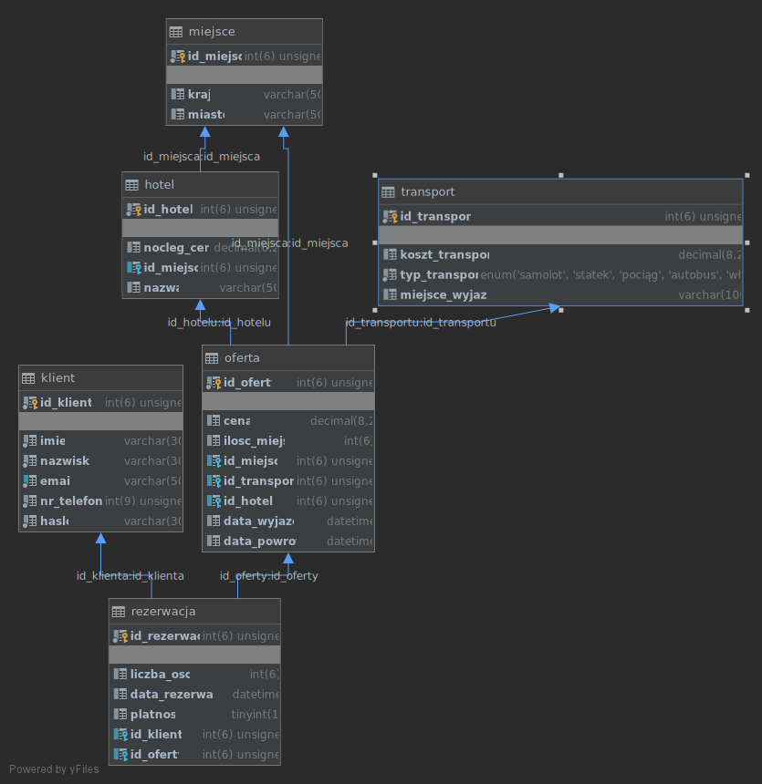

# Temat projektu
Projekt bazy biura podróży wykonany w ramach ćwiczeń projektowych z Baz Danych.

| Nazwisko i imię  | Wydział | Kierunek | Semestr | Grupa | Rok akademicki |
| :-------------:  | :-----: | :------: | :-----: | :---: | :------------: |
| Krasoń Aleksandra| WIMiIP  | IS       |   4     | 2     | 2019/2020      |
| Kusik Karol      | WIMiIP  | IS       |   4     | 2     | 2019/2020      |

## Projekt bazy danych
Diagram bazy:



Temat: Biuro podróży

Jest to realizacja bazy danych biura podróży organizującego wakacyjne wycieczki międzynarodowe. 

Baza znajduje się w pliku podroze_db.sql

Baza danych składa się z 6 encji:
<ul>
<li>Klient</li>
<li>Rezerwacja</li>
<li>Oferta</li>
<li>Miejsce</li>
<li>Hotel</li>
<li>Transport</li>
</ul>

Każda z nich jest połączona odpowiednimi relacjami, które umożliwiają wprowadzenie wielu rozbudowanych funkcjonalności.

Tworzenie tabeli:
```sql
create table klient
(
    id_klienta  int(6) unsigned auto_increment primary key,
    imie        varchar(30)     not null,
    nazwisko    varchar(30)     not null,
    email       varchar(50)     unique not null,
    nr_telefonu int(9) unsigned not null,
    haslo varchar(30) not null
);
```
```sql
create table hotel
(
    id_hotelu   int(6) unsigned auto_increment primary key,
    nocleg_cena decimal(6, 2)   null,
    id_miejsca  int(6) unsigned null,
    nazwa       varchar(50)     null,
    constraint hotel_ibfk_1 foreign key (id_miejsca) references miejsce (id_miejsca)
);

create index id_miejsca
    on hotel (id_miejsca);

```

Wprowadzenie danych:
```sql
INSERT INTO podroze_db.miejsce (id_miejsca, kraj, miasto) VALUES (1, 'Polska', 'Zakopane');
INSERT INTO podroze_db.miejsce (id_miejsca, kraj, miasto) VALUES (2, 'Polska', 'Gdańsk');
INSERT INTO podroze_db.miejsce (id_miejsca, kraj, miasto) VALUES (3, 'Polska', 'Olsztyn');
INSERT INTO podroze_db.miejsce (id_miejsca, kraj, miasto) VALUES (4, 'Polska', 'Ciechocinek');
```

```sql
INSERT INTO podroze_db.hotel (id_hotelu, nocleg_cena, id_miejsca, nazwa) VALUES (1, 100.56, 5, 'El Pingüino');
INSERT INTO podroze_db.hotel (id_hotelu, nocleg_cena, id_miejsca, nazwa) VALUES (2, 255.78, 12, 'Paradis');
INSERT INTO podroze_db.hotel (id_hotelu, nocleg_cena, id_miejsca, nazwa) VALUES (3, 92.00, 2, 'Smart');
INSERT INTO podroze_db.hotel (id_hotelu, nocleg_cena, id_miejsca, nazwa) VALUES (4, 390.15, 6, 'Poseidon');
INSERT INTO podroze_db.hotel (id_hotelu, nocleg_cena, id_miejsca, nazwa) VALUES (5, 120.24, 10, 'Pied-a-Terre');
```

W pliku funkcje.py został wprowadzony ALTER tablic do naprawy inkrementacji po wycofaniu się z dodawania nowych rekordów
```sql
SELECT MAX(id_oferty) FROM oferta;
ALTER TABLE oferta AUTO_INCREMENT = 24;
```
(przykładowe dane, które w programie są otrzymywane z zapytań)
## Implementacja zapytań SQL

[1]. Sortowanie ofert od najniższej ceny:

```sql
SELECT m.kraj, m.miasto, h.nazwa, t.typ_transportu, t.miejsce_wyjazdu, cena, data_wyjazdu, 
data_powrotu FROM oferta o 
LEFT JOIN miejsce m ON m.id_miejsca = o.id_miejsca 
INNER JOIN hotel h ON h.id_hotelu = o.id_hotelu 
INNER JOIN transport t ON t.id_transportu = o.id_transportu
ORDER BY cena;
```

[2]. Sortowanie ofert od najwyższej ceny:

```sql
SELECT m.kraj, m.miasto, h.nazwa, t.typ_transportu, t.miejsce_wyjazdu, cena, data_wyjazdu, 
data_powrotu FROM oferta o 
LEFT JOIN miejsce m ON m.id_miejsca = o.id_miejsca 
INNER JOIN hotel h ON h.id_hotelu = o.id_hotelu 
INNER JOIN transport t ON t.id_transportu = o.id_transportu
ORDER BY cena DESC;
```

[3]. Sortowanie ofert alfabetycznie od A do Z z pogrupowaniem na poszczególne hotele:
```sql
SELECT m.kraj, m.miasto, h.nazwa, t.typ_transportu, t.miejsce_wyjazdu, cena, data_wyjazdu, 
data_powrotu FROM oferta o 
LEFT JOIN miejsce m ON m.id_miejsca = o.id_miejsca 
INNER JOIN hotel h ON h.id_hotelu = o.id_hotelu 
INNER JOIN transport t ON t.id_transportu = o.id_transportu
GROUP BY h.nazwa ORDER BY m.miasto;
```
[4]. Sortowanie ofert alfabetycznie od Z do A z pogrupowaniem na poszczególne hotele:
```sql
SELECT m.kraj, m.miasto, h.nazwa, t.typ_transportu, t.miejsce_wyjazdu, cena, data_wyjazdu, 
data_powrotu FROM oferta o 
LEFT JOIN miejsce m ON m.id_miejsca = o.id_miejsca 
INNER JOIN hotel h ON h.id_hotelu = o.id_hotelu 
INNER JOIN transport t ON t.id_transportu = o.id_transportu
GROUP BY h.nazwa ORDER BY m.miasto DESC;
```

[5]. Sortowanie ofert od najpopularniejszej oferty:

```sql
SELECT m.kraj, m.miasto, h.nazwa, t.typ_transportu, t.miejsce_wyjazdu, cena, data_wyjazdu, 
data_powrotu, COUNT(r.id_rezerwacji) AS LiczbaKupionych FROM oferta o 
LEFT JOIN miejsce m ON m.id_miejsca = o.id_miejsca 
INNER JOIN hotel h ON h.id_hotelu = o.id_hotelu 
INNER JOIN transport t ON t.id_transportu = o.id_transportu
LEFT JOIN rezerwacja r ON r.id_oferty = o.id_oferty 
GROUP BY h.nazwa ORDER BY LiczbaKupionych DESC;
```
[6]. Sortowanie ofert od najrzadziej kupowanej:

```sql
SELECT m.kraj, m.miasto, h.nazwa, t.typ_transportu, t.miejsce_wyjazdu, cena, data_wyjazdu, 
data_powrotu, COUNT(r.id_rezerwacji) AS LiczbaKupionych FROM oferta o 
LEFT JOIN miejsce m ON m.id_miejsca = o.id_miejsca 
INNER JOIN hotel h ON h.id_hotelu = o.id_hotelu 
INNER JOIN transport t ON t.id_transportu = o.id_transportu
LEFT JOIN rezerwacja r ON r.id_oferty = o.id_oferty 
GROUP BY h.nazwa ORDER BY LiczbaKupionych ASC;
```

[7]. Wyświetlanie miejsc w danym kraju
```sql
SELECT kraj,miasto FROM miejsce 
WHERE kraj LIKE 'Hiszpania'
```

[8]. Wyświetlanie hoteli w danym kraju
```sql
SELECT  hotel.id_hotelu, kraj,miasto,hotel.nazwa,hotel.nocleg_cena FROM miejsce
INNER JOIN hotel ON miejsce.id_miejsca = hotel.id_miejsca
WHERE kraj LIKE 'Kanada';
```

[9]. Wyświetlanie miejsc z bazy razem z id (potrzebne do dodawania miejsc)
```sql
SELECT * FROM miejsce;
```

[10].Wyświetlanie transportu z bazy razem z id (potrzebne do dodawania ofert)
```sql
SELECT * FROM transport
```

[11].Dodawanie nowych miejsc do bazy
```sql
INSERT INTO podroze_db.miejsce (kraj, miasto) VALUES ( 'Polska', 'Sandomierz');
```
 - wyświetlenie wprowadzonych zmian (aby, użytkownik mógł zdecydować czy na pewno chce je wykonać(commit/rollback))
 ```sql
SELECT kraj,miasto FROM miejsce WHERE kraj = 'Polska' AND miasto = 'Sandomierz';
```

[12]
```sql
INSERT INTO podroze_db.hotel (nocleg_cena, id_miejsca, nazwa) VALUES ( 315, 5,'Mały Rzym');
```
- wyświetlenie wprowadzonych zmian (aby, użytkownik mógł zdecydować czy na pewno chce je wykonać(commit/rollback))
```sql
SELECT nocleg_cena, nazwa FROM hotel WHERE nazwa = 'Mały Rzym';
```

[13].
```sql

```

## Aplikacja
W aplikacji menu startowe zawiera opcje:
<ul>
<li>1.Logowanie do panelu pracownika </li>
<li>2.Logowanie jako klient</li>
<li>3.Rejestracja</li>
<li>4.Wyjście</li>
</ul>

Panel pracownika zabezpieczony jest hasłem, tak aby klienci nie mogli edytować bazy danych według swoich upodobań.
Logowanie jako klient pobiera e-mail od użytkownika i sprawdza czy użytkownik jest zarejestrowany w bazie, po czym pobiera hasło i sprawdza jego poprawność.
Jeżeli klient nie jest zarejestrowany w bazie może to zrobić wybierając opcję numer 3.

Po zalogowaniu do panelu pracownika wyświetlają się opcje:
<ul>
<li>1.Dodawanie miejsca do bazy </li>
<li>2.Dodawanie hotelu do bazy</li>
<li>3.Dodawanie oferty</li>
<li>4.Nowa cena noclegu w hotelu</li>
<li>5.Aktualizacja stanu płatności rezerwacji</li>
<li>6.Powrót do menu</li>
<li>7.Wyjście</li>
</ul>

Po wybraniu interesującej nas funkcji aplikacja wykonuje polecenia SQL potrzebne do prawidłowej edycji bazy.

Panel klienta składa się z :

<ul>
<li>1.Dostępne oferty </li>
<li>2.Wyszukaj miejsce</li>
<li>3.Wykonaj rezerwacje</li>
<li>4.Moje rezerwacje</li>
<li>5.Usuń rezerwację</li>
<li>6.Powrót do menu</li>
<li>7.Wyjście</li>
</ul>

Opcja dostępne oferty wyświetla listę ofert biura posortowanych według wyboru użytkownika : Najpopularniejsze, Najtańsze, Alfabetycznie itp.

Wyszukaj miejsce służy do sprawdzenia czy w bazie biura jest miejsce, które interesuje klienta. W przypadku wystąpienia odpowiedniego miejsca,
użytkownik ma możliwość wyświetlenia hoteli w danym kraju.

Kolejne opcje służą do zarządzania rezerwacjami na zaoferowane przez biuro podróże.

Aplikacja podzielona jest na 4 pliki main.py - do uruchomienia programu z załączonym menu startowym, klient.py i pracownik.py, które zawierają panele 
z odpowiednimi funkcjami do wyboru oraz funkcje.py, w którym zawarte są wszystkie funkcjonalności potrzebne do prawidłowego działania programu. 
## Dodatkowe uwagi
W przypadku, gdy klient nie widzi odpowiedniej dla siebie oferty pracownik może stworzyć indywidualną ofertę z określoną liczbą miejsc. 